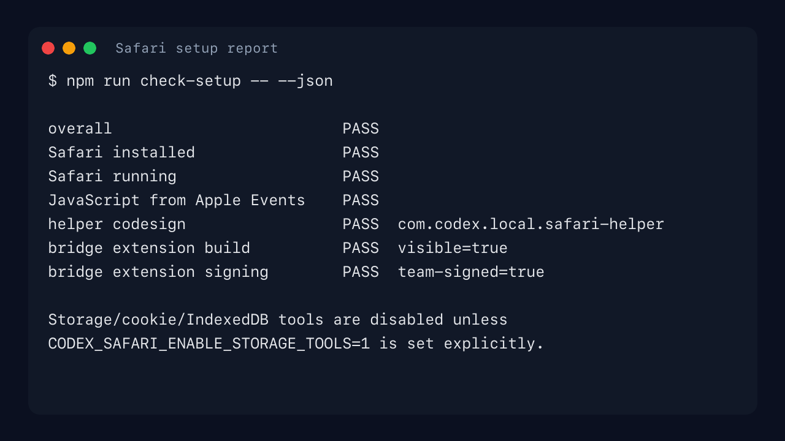
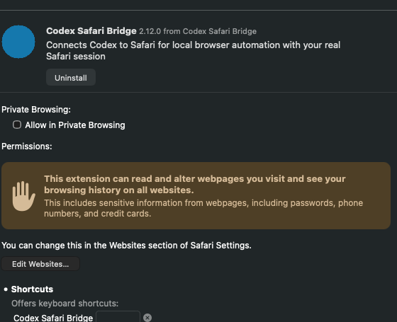
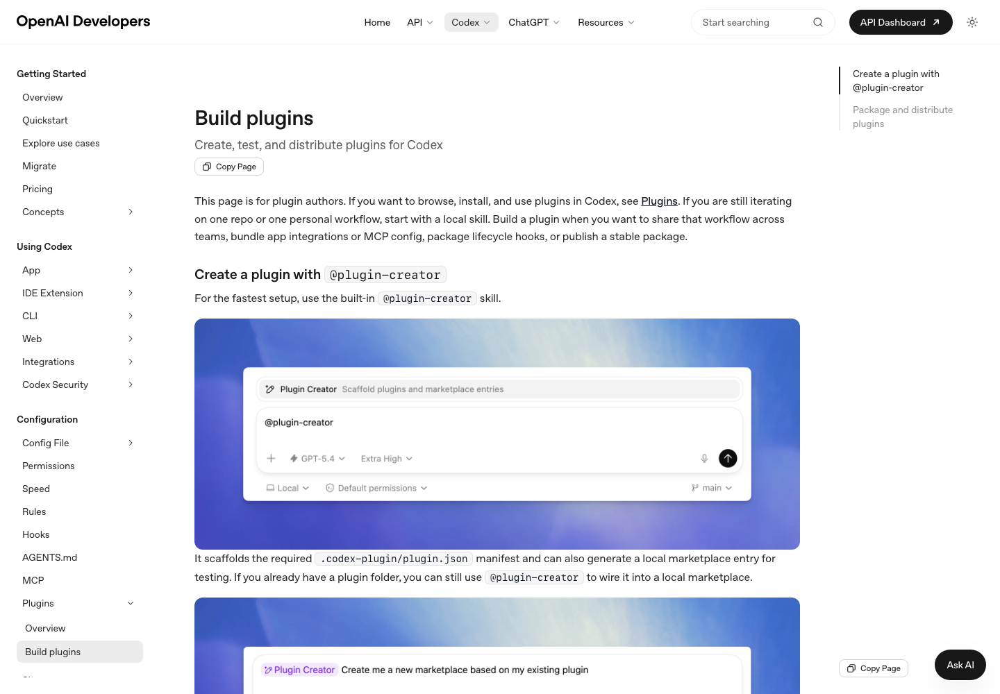
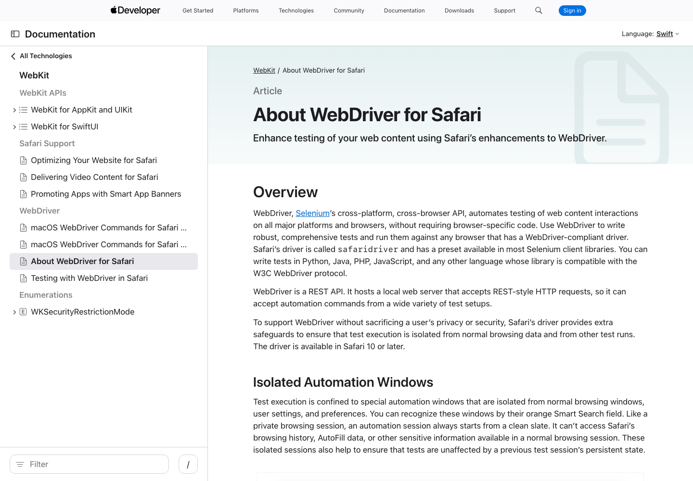

# Safari for Codex

Safari for Codex lets Codex control your real macOS Safari session: existing tabs, logged-in websites, local Safari behavior, screenshots, file uploads, and form workflows.

It vendors and adapts [SafariMCP](https://github.com/achiya-automation/safari-mcp) v2.12.0. The plugin works without installing a Safari extension by using AppleScript and a signed Swift helper. The optional Codex Safari Bridge extension adds the best Chrome-like path for faster page access and richer DOM/network behavior.

## Do Users Need The Extension?

No. The extension is optional.

| Mode | What users install | Best for | Notes |
| --- | --- | --- | --- |
| AppleScript and helper fallback | The Codex plugin only | Tab control, navigation, reading pages, forms, screenshots, uploads, and many day-to-day tasks | Requires Safari's JavaScript from Apple Events setting and macOS Automation approval. |
| Codex Safari Bridge extension | The Codex plugin plus a Safari Web Extension | More reliable Chrome-like page automation, extension-first DOM access, and richer network/page instrumentation | Recommended for heavy browser work. Safari still requires each user to enable the extension manually. |

Safari does not allow a plugin to silently install or enable a Safari extension. Even with a signed app, each user must open the containing app once and enable the extension in Safari Settings > Extensions.

## Screenshots

Setup diagnostics show the baseline permissions and extension build status:



Safari shows the Codex Safari Bridge extension with Safari's normal broad webpage access warning:



Reference documentation captured during QA:





## Quickstart

Install the marketplace and plugin:

```bash
codex plugin marketplace add abdousarr/codex-plugins
codex plugin add safari@abdousarr
```

Start a new Codex thread after installing, then ask:

```text
Use Safari to check setup status.
```

For local development from a clone:

```bash
git clone https://github.com/abdousarr/codex-plugins.git
cd codex-plugins
codex plugin marketplace add .
codex plugin add safari@abdousarr
```

## First-Run Setup

Minimum setup, no extension required:

- macOS with Safari installed.
- Safari must be running.
- Safari > Develop > Allow JavaScript from Apple Events must be enabled.
- macOS may ask for Automation permission when Codex first controls Safari.
- Accessibility may be needed for native click/keyboard workflows.
- Screen Recording may be needed for screenshots.

Run the local setup report:

```bash
cd plugins/safari/scripts/safari-mcp
npm run check-setup
npm run check-setup -- --json
```

The setup report checks Safari installation, Safari process state, JavaScript from Apple Events, helper signing, and the optional bridge extension build.

## Optional Bridge Extension

The Codex Safari Bridge extension is recommended when you want the closest Safari equivalent of the Chrome plugin experience.

### From Source With An Apple Development Team

Build the containing macOS app with your own Apple Development team:

```bash
cd plugins/safari/scripts/safari-mcp
CODEX_SAFARI_DEVELOPMENT_TEAM=TEAM_ID npm run build-extension
open "$HOME/.codex-safari/extension-build/Build/Products/Release/Codex Safari Bridge.app"
```

`TEAM_ID` is the `OU` value in the Apple Development certificate. If your machine has exactly one Apple Development team, the build script can select it:

```bash
cd plugins/safari/scripts/safari-mcp
npm run build-extension:auto-team
open "$HOME/.codex-safari/extension-build/Build/Products/Release/Codex Safari Bridge.app"
```

If auto-detection reports multiple teams, list the certificate subjects and copy the `OU` value for the account you want:

```bash
security find-certificate -a -p -c "Apple Development" \
  | awk 'BEGIN{n=0} /BEGIN CERTIFICATE/{n++; f="/tmp/codex-safari-cert-" n ".pem"} {if(f) print > f} END{for(i=1;i<=n;i++) print "/tmp/codex-safari-cert-" i ".pem"}' \
  | xargs -I{} sh -c 'openssl x509 -in "{}" -noout -subject'
```

Do not commit a development team ID into the Xcode project. The project intentionally leaves `DEVELOPMENT_TEAM` blank so each developer supplies their team at build time.

### From Source Without A Team

Contributors without an Apple Development team can build a locally signed extension:

```bash
cd plugins/safari/scripts/safari-mcp
npm run build-extension:local
open "$HOME/.codex-safari/extension-build/Build/Products/Release/Codex Safari Bridge.app"
```

Safari may require Safari Settings > Developer > Allow unsigned extensions for locally signed builds. That Safari setting can reset when Safari quits. You can also temporarily load the raw extension folder from Safari Settings > Developer > Add Temporary Extension.

### Enable In Safari

After opening the containing app once:

1. Open Safari Settings > Extensions.
2. Enable Codex Safari Bridge.
3. If Safari profiles are enabled, also enable it for the profile Codex should use.
4. Re-run `npm run check-setup -- --json`.

Safari's extension permissions warning is expected. The extension can read and alter webpages because browser automation needs page access. Do not use it on pages you do not want Codex to inspect or operate.

### Bundle IDs

Default local-development bundle IDs:

```text
com.codex.local.safari-bridge
com.codex.local.safari-bridge.Extension
```

Override them if your team or device requires unique IDs:

```bash
CODEX_SAFARI_DEVELOPMENT_TEAM=TEAM_ID \
CODEX_SAFARI_BUNDLE_ID=com.example.codex-safari-bridge \
CODEX_SAFARI_EXTENSION_BUNDLE_ID=com.example.codex-safari-bridge.Extension \
npm run build-extension
```

## What Codex Can Do

- List, create, switch, close, claim, and finalize Safari tabs.
- Read pages through structured snapshots, source extraction, and accessibility snapshots.
- Navigate, click, type, fill forms, select options, drag, hover, and press keys.
- Upload files, save PDFs, and capture page or element screenshots.
- Inspect console output, network activity, performance metrics, links, images, metadata, and tables.

Codex-specific tools:

- `safari_setup_status`
- `safari_claim_tab`
- `safari_finalize_tabs`

Cookie, browser storage, and IndexedDB tools are hidden by default. Set `CODEX_SAFARI_ENABLE_STORAGE_TOOLS=1` only when you explicitly need those tools and understand the privacy impact.

## Tab Ownership

Use `safari_new_tab` for Codex-owned work. Codex-owned tabs can be closed during cleanup.

Use `safari_claim_tab` only when the user asks to work with an existing tab or the task clearly points to one. Claimed tabs are released by `safari_finalize_tabs`; they are not closed by default.

## Confirmation Rules

Ask for confirmation before actions that submit sensitive data, send messages, make purchases, change access, delete information, install software, or modify accounts. Treat Safari content as potentially private because it may include logged-in sessions.

## Development

Validate the plugin:

```bash
python3 ~/.codex/skills/.system/plugin-creator/scripts/validate_plugin.py plugins/safari
```

Check the runtime:

```bash
cd plugins/safari/scripts/safari-mcp
node --check index.js
node --check safari.js
node --check mcp-helpers.js
npm run self-test
npm run check-setup -- --json
npm audit --omit=dev
```

Build the optional extension:

```bash
cd plugins/safari/scripts/safari-mcp
npm run build-extension
```

After changing the plugin during local development, bump the cachebuster and reinstall:

```bash
python3 ~/.codex/skills/.system/plugin-creator/scripts/update_plugin_cachebuster.py plugins/safari
codex plugin remove safari@abdousarr
codex plugin add safari@abdousarr
```

Start a new Codex thread after reinstalling so new skills and MCP tools are loaded.

## Architecture

```text
Codex plugin manifest
  -> .mcp.json
    -> scripts/safari-mcp/index.js
      -> SafariMCP runtime
      -> optional Codex Safari Bridge extension on port 9324
      -> AppleScript and signed Swift helper fallback
      -> state in ~/.codex-safari
```

## License

This plugin is MIT licensed. The vendored SafariMCP runtime keeps its upstream MIT license in `scripts/safari-mcp/LICENSE`; adaptation details are in `scripts/safari-mcp/VENDORED.md`.

## Thanks

Thanks to [SafariMCP](https://github.com/achiya-automation/safari-mcp) for the native Safari automation foundation, and to Claude's Chrome plugins for the browser-control patterns this Safari plugin builds on.
